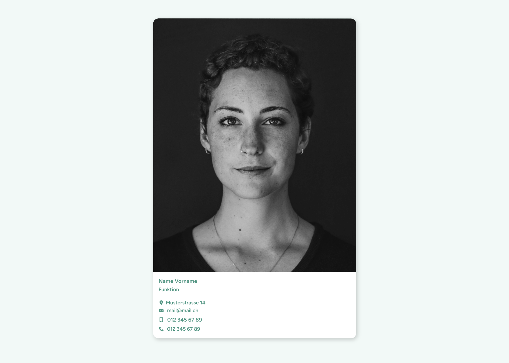

# UD Block: Personal Card

Ein flexibler Block zur Darstellung von **Personenkarten** mit Bild, Name, Funktion und optionalen Zusatzinformationen.
Er eignet sich für Teamseiten, Lehrpersonenverzeichnisse oder Vorstandsübersichten und kann mit Filter-Containern kombiniert werden.

## Funktionen

- Darstellung einzelner Personen mit:
  - Profilbild (Media Library oder Upload)
  - Name, Funktion, Abteilung, Beschreibung
  - Optionalen Zusatzfeldern (z. B. Kontakt, Tags)
- Kompatibel mit dem **Filter-Container (`ud-personal-card-filter-container`)**
- Optionaler Tag-Support über `data-tags` und `data-tags-slug`
- Unterstützung für Full Site Editing (FSE)
- Schnelles Laden durch serverseitiges Rendering

## Screenshots

*Die Personal Card im Frontend*

*Editor-Oberfläche mit Eingabefeldern.*

## Technische Details

- Entwickelt mit [`@wordpress/scripts`](https://developer.wordpress.org/block-editor/reference-guides/packages/packages-scripts/)
- Getrennte Logik für Editor (`edit.js`) und Frontend (`render.php`)
- Dynamisches Rendering über PHP:
  - `render.php` – Ausgabe der Kartenstruktur
  - `enqueue.php` – Laden der Styles und Skripte
  - `ud-personal-card-block.php` – Registrierung des Blocks
- Automatische Klassennamen und semantische HTML-Struktur
- Zentrale Datenattribute zur Filterung:
  - `data-tags`
  - `data-tags-slug`

## Installation

1. Plugin-Ordner `ud-personal-card-block` in `wp-content/plugins/` kopieren
2. Im WordPress-Backend unter **Plugins → Installierte Plugins** aktivieren
3. Im Block-Editor den Block **„UD Personal Card“** einfügen und Inhalte hinzufügen
4. Optional mit dem **Filter-Container** kombinieren, um dynamische Filterung zu aktivieren

## Autor

[ulrich.digital gmbh](https://ulrich.digital)

## Lizenz

GPL v2 or later
[https://www.gnu.org/licenses/gpl-2.0.html](https://www.gnu.org/licenses/gpl-2.0.html)

